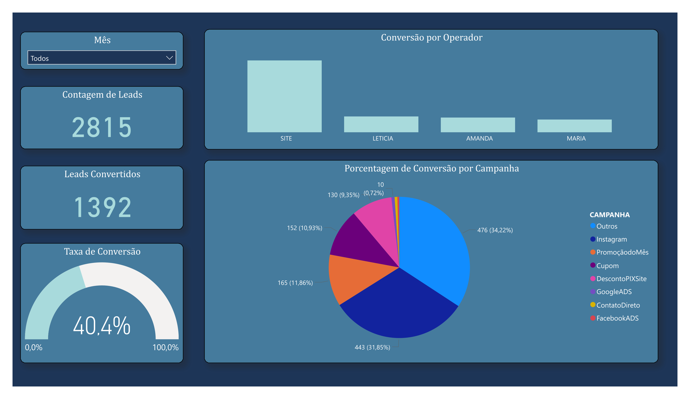

# 📊 Dashboard de Leads – Power BI

Este projeto foi desenvolvido com o objetivo de aprimorar meus conhecimentos em **Power BI** e práticas de análise de dados.  
Utilizei uma base de dados fictícia para simular um cenário de **marketing e vendas**.

---

## 🎯 Objetivos do Projeto
- Praticar **ETL** e modelagem de dados no Power BI  
- Construir **indicadores KPIs** de leads e conversões  
- Explorar **relações entre tabelas** para enriquecer análises  
- Aplicar **análise descritiva** para responder à pergunta: *“o que aconteceu com os leads?”*

---

## 🛠️ Etapas Realizadas
- Extração dos **DDDs** a partir dos números de telefone  
- Criação de tabela auxiliar com **DDD, estado, região e sigla**  
- Relacionamento entre tabelas para gerar métricas por estado  
- Construção de dashboard com:
  - Quantidade de leads
  - Leads convertidos
  - Taxa de conversão
  - Desempenho por operador
  - Conversão por campanha
  - Distribuição geográfica por estado

---

## 📈 Tipo de Análise
Foi realizada uma **análise descritiva**, destacando indicadores e padrões nos dados, sem foco em previsão ou prescrição.

---

## 🖼️ Prints do Dashboard

---

## 🚀 Tecnologias Utilizadas
- Power BI Desktop  
- Modelagem de Dados  
- ETL (Power Query)  

---

## 📌 Observação
Os dados utilizados são **fictícios** e têm apenas finalidade de estudo.
